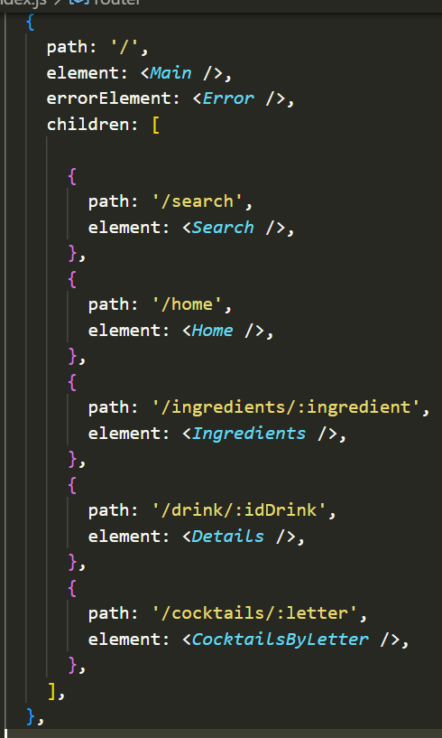


En esta práctica realizaremos una aplicación web SPA basada en el framework React de JS. En nuestro caso trabajaremos sobre la API de **TheCocktailDB**.
1. # Requisitos técnicos que ha de cumplir:
- Se han de programar al menos seis componentes y jerárquicamente organizados en al menos 3 niveles de anidamiento.
- La aplicación ha de tener distintas rutas usando React Router
- La aplicación ha de acceder a datos de alguna API propia o de terceros mediante técnicas AJAX, ya sea en modo de lectura o también de escritura si se tienen permisos. Para ello se realizará una librería de funciones que tendrá que estar alojada en el directorio /src/services del proyecto
- La aplicación ha de estar bien estructurada escogiendo alguna de las filosofías explicadas en clase: Folder By Type o Folder By Feature. 
- Los estilos han de ser aplicados usando la terminología BEM
- El proyecto debe tener instalada la dependencia de Eslint y tiene que estar configurado para validar el código según el estándar de AirBnB
1. # Prototipo
   Hemos realizado el siguiente prototipo en Figma: <https://www.figma.com/file/7Wg9gSRaLCMM1ikjMBLFNi/The-Cocktail-DB?type=design&node-id=0%3A1&mode=design&t=m3duvzCwJ4SUxzEv-1>
1. # Repositorio
   github.com/[alexisabels/thecocktaild](https://github.com/alexisabels/thecocktaildb)b

1. #  Implementación 
### Elección de la API
Hemos escogido la API de **TheCocktailDB** que es como una gran biblioteca de información sobre cócteles y bebidas. Proporciona recetas, imágenes, y otra información útil sobre diferentes tipos de bebidas.

Para hacer estas solicitudes desde nuestra aplicación, escribimos funciones especiales que utilizan herramientas como fetch para enviar solicitudes a la API y recibir los datos que necesitamos. Luego, podemos usar esos datos para mostrarlos en nuestra aplicación de la manera que queramos, como mostrar imágenes de cócteles, listar recetas, etc.

Por ejemplo, si queremos mostrar un cóctel aleatorio en nuestra aplicación, podemos pedirle a la API de **TheCocktailDB** un cóctel aleatorio y la API nos enviará los detalles de ese cóctel, como su nombre, ingredientes, y cómo hacerlo.

### Explicación de los distintos componentes que conforman la aplicación
**Card:** Es una tarjeta que nos muestra la información de una bebida. Tiene un enlace que redirige a una vista detallada de la bebida, una imagen, y el título de la bebida en un formato específico.

**CardList:** Este recibe una lista de bebidas como propiedades y devuelve las tarjetas con la información.

**CocktailsByLetter:** En este utilizaremos useState, y useEffect para mostrar la lista de cócteles que comienzan con una letra específica. Utiliza el hook useParams de React Router para obtener la letra de la URL, realiza una solicitud a la API (getCocktailByLetter), actualiza el estado con la lista de cócteles recuperados, y luego muestra la lista utilizando el componente CardList.

**DrinkDetail:**Volvemos a utilizar useState, y useEffect para mostrar detalles de un cóctel específico. Recibe la propiedad id que se utiliza para hacer una solicitud a la API (getCocktailDetail). La información obtenida se almacena en el estado local (data) y se muestra en la interfaz. Utiliza un componente extra DrinkIngredients (explicado después) para mostrar los ingredientes del cóctel.

**Footer:** El pie de página tiene enlaces alfabéticos para navegar por nombres de cócteles.Aquí utilizamos React Router (Link) para generar enlaces dinámicamente para cada letra del alfabeto.

**Header:** Este que contiene el logo, un botón de búsqueda y un botón de inicio. Este también utiliza React y React Router (Link) para dar navegación a las diferentes secciones de la aplicación.

**DrinkIngredients:** Este recibe una prop llamada “ingredients” de los detalles de la bebida y muestra una lista de los ingredientes que contiene, con enlaces a la ruta ingredients/${ingredient}.

**PopularDrinks:** El componente carga y muestra una selección de cócteles populares utilizando unos IDs que ya le hemos dado, y realiza solicitudes individuales para obtener cada uno. Esto lo hacemos así ya que la solicitud a la API para cocktails populares es de pago, así que los elegimos manualmente.

**PopularIngredients:** Muestra una selección de ingredientes populares utilizados en cócteles. Utiliza un conjunto predefinido de ingredientes de la misma forma que PopularDrinks. Al igual que en el mencionado, la solicitud para ingredientes populares era de pago, de ahí la elección manual.

**RandomsList:** Muestra una selección de 8 cócteles aleatorios, realiza la solicitud a la API y muestra las tarjetas.

**SearchBox:** Es un cuadro de búsqueda, este recibe dos propiedades, placeholder y onSearchChange. El usuario puede ingresar texto en el cuadro de búsqueda, y cada vez que cambia, se invoca la función onInputChange para manejar el cambio en el término de búsqueda. La entrada de texto está vinculada a la función onSearchChange a través del evento onChange.

### Explicación de las rutas creadas en la aplicación.

La ruta por defecto será Main, y contaremos además con distintas rutas a las que viajar.

- **Search** para la página de buscar
- **Home** para la página de inicio con los cócteles e ingredientes que hemos elegido (randoms, favoritos…)
- **Ingredients**, para ver un ingrediente y todos los cócteles que lo incluyen (pasándole un nombre, por ejemplo /ingredients/Ice)
- **Drink** para la página de detalles de cada bebida, pasándole el id, por ejemplo /drink/17005. Dentro incluye información sobre la bebida así como los ingredientes, enlazando cada uno a la ruta Ingredients pasándole su nombre.
- **Cocktails** para la lista de cócteles en la búsqueda por letra. Habrá que pasarle una letra (desde los enlaces del footer) para que nos lleve a la ruta, por ejemplo /cocktails/A para los que empiezan con la A.

